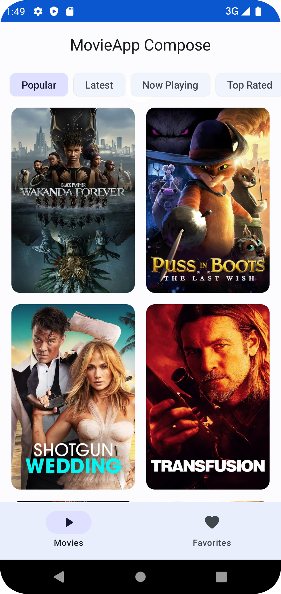
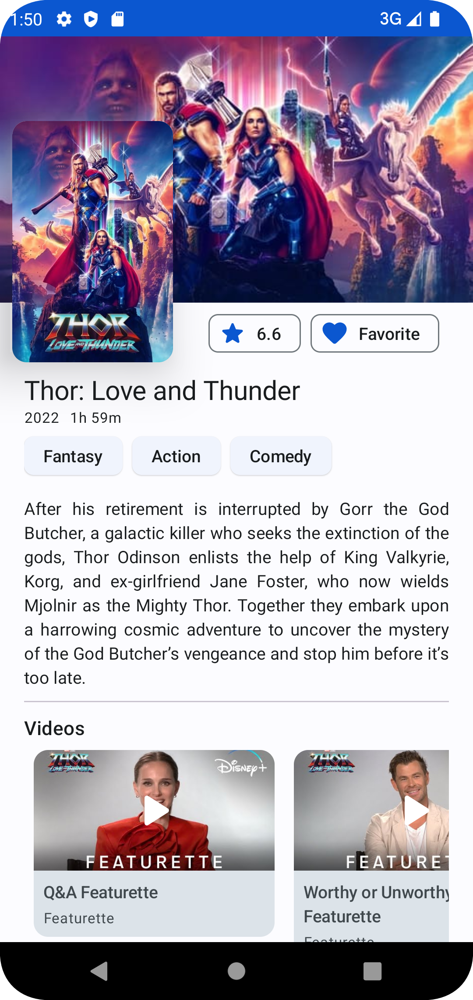

# movieapp-compose
MovieApp using Compose

## Requirements

- Git
- JDK 11
- Android Studio Electric Eel | 2022.1.1 Patch 1 + SDK
- MovieDB API

## Demo & Screenshots

| Demo | Movies | Favorites | Detail |
|--|--------|-----------|--------|
|  |        |           |        |

## todo